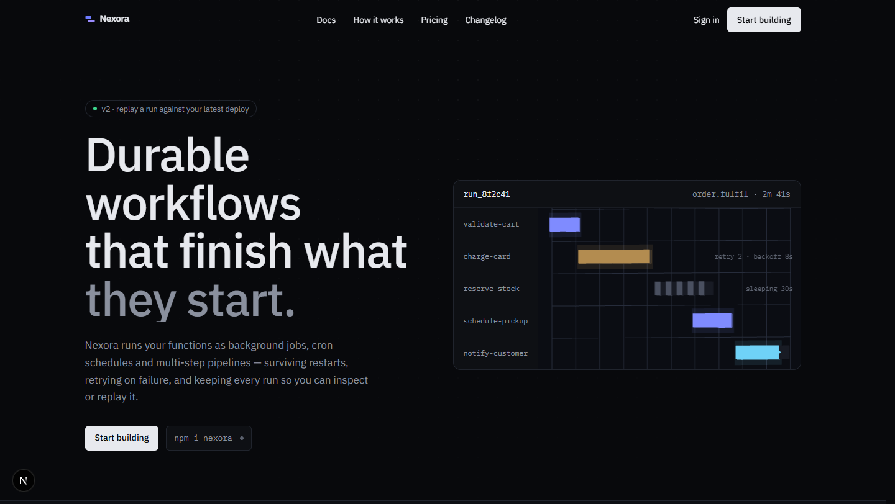
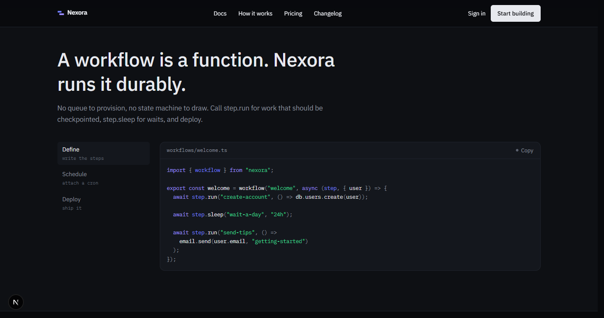
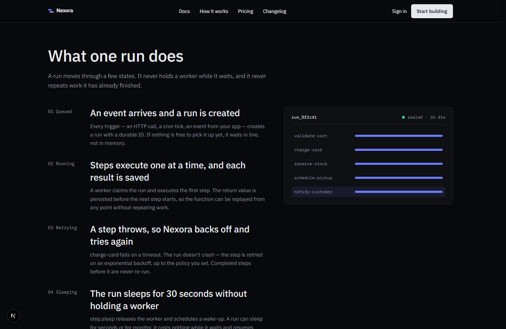
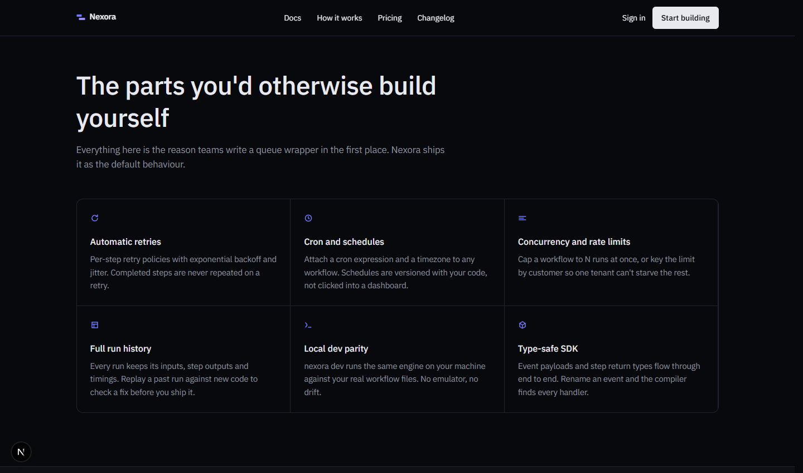
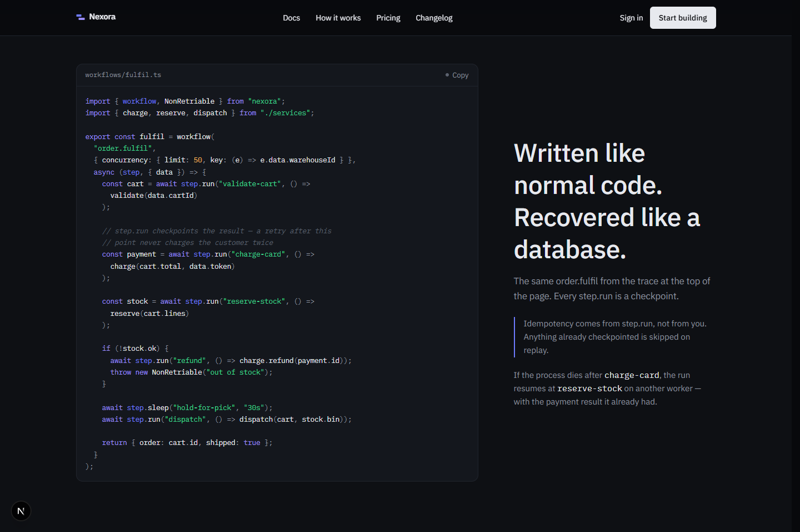
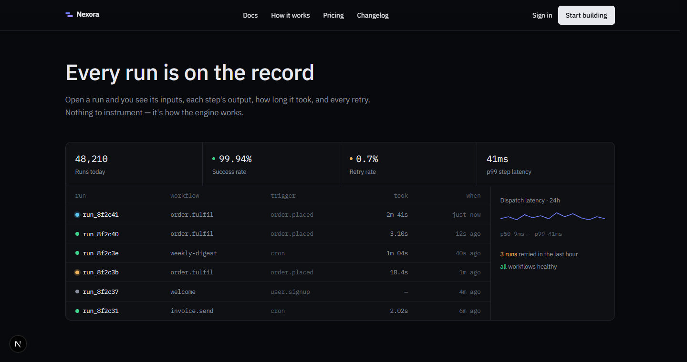
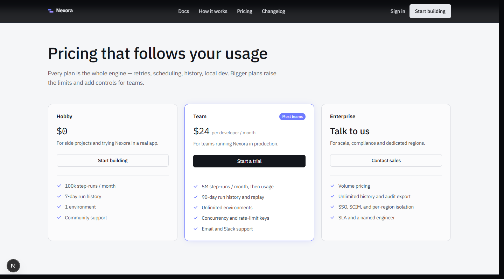
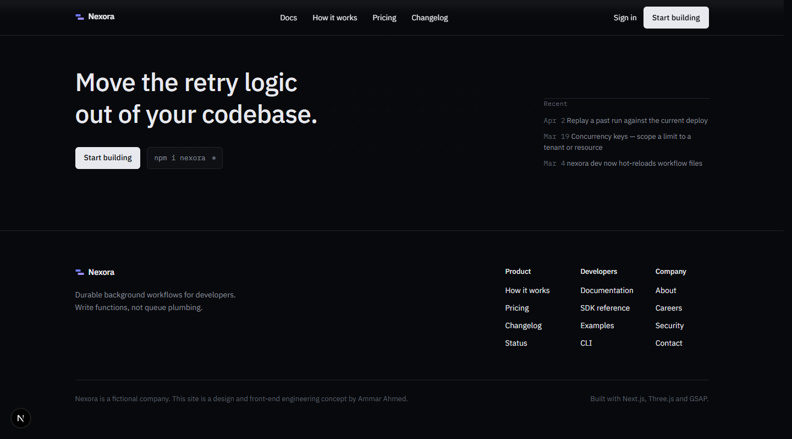
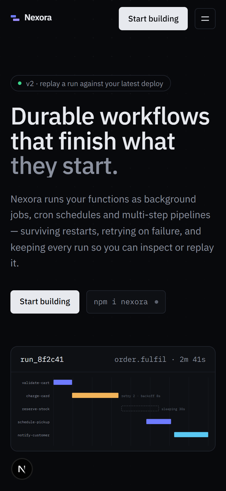

# Nexora

A concept landing page for **Nexora**, a fictional developer-infrastructure
company. Built from scratch as a portfolio piece — original design, original
copy, and a hand-built 3D hero — to show what a modern, motion-heavy product
site looks like when it's done properly.

> **Nexora isn't a real company and there's no client.** This is a design and
> front-end engineering exercise. It's also stated in the site's footer.

**Live:** https://nexora-ammarahmednot-8455s-projects.vercel.app



---

## The idea

The fictional product is a **durable workflow engine**: you write ordinary
functions, and Nexora runs them as background jobs, cron schedules and
multi-step pipelines that survive restarts, retry themselves with backoff, and
keep a full history of every run. The whole page is built around one object —
**a run** — and every section returns to it.

## What's interesting here

- **A hand-built 3D hero.** The run trace in the hero is a live
  [React Three Fiber](https://r3f.docs.pmnd.rs/) scene — extruded timeline lanes
  on a grid, one step retrying, one sleeping, data pulses on the completed
  lanes. No Spline, no pre-made asset; it's ~200 lines of Three.js. Falls back
  to a static SVG under 900px, without WebGL, or under reduced-motion.
- **Scroll-driven "how a run works".** A GSAP + ScrollTrigger sequence pins the
  section and advances a run through its states (queued → running → retrying →
  sleeping → sealed) as you scroll. Lenis drives the smooth scroll.
- **A domain-derived colour system.** State colours (running / retrying /
  succeeded) appear *only* on things that represent a state — the trace, the
  dashboard, status dots — never as decoration. Everything else is one ink, one
  panel, one brand accent.
- **One light section.** Pricing is the single light band in an otherwise dark
  page, so the page has a spine instead of a single mood.
- **A tiny syntax highlighter** (`src/lib/highlight.tsx`) — ~120 lines, no
  Prism/Shiki — because the page only has a handful of code samples.
- Accessible baseline: keyboard focus styles, `prefers-reduced-motion`
  respected everywhere (3D freezes, scroll sequences render their end state),
  AA text contrast, responsive to 360px.

The full design rationale is in [`docs/DESIGN.md`](docs/DESIGN.md).

## Screenshots

| Quickstart | How a run works |
| --- | --- |
|  |  |

| Features | Code showcase |
| --- | --- |
|  |  |

| Observability | Pricing |
| --- | --- |
|  |  |

| Call to action | Mobile |
| --- | --- |
|  |  |

## Stack

- **Next.js 16** (App Router, statically rendered) · **TypeScript** · **Tailwind CSS v4**
- **React Three Fiber** + **three** + **@react-three/drei** — the hero 3D
- **GSAP** + **ScrollTrigger** — the scroll sequence and hero entrance
- **Lenis** — smooth scroll
- Deployed on **Vercel**

## Running locally

```bash
npm install
npm run dev        # http://localhost:3000
npm run build      # production build
npm run typecheck
```

## Structure

```
src/
  app/
    layout.tsx          Fonts (IBM Plex Sans/Mono), metadata, smooth-scroll provider
    page.tsx            Composes the sections + JSON-LD
    globals.css         Design tokens + the recurring "time axis" motif
  components/
    hero.tsx            Headline + the run-trace card
    run-trace-3d.tsx    The React Three Fiber scene
    run-trace-svg.tsx   Static fallback for the same trace
    how-a-run-works.tsx Pinned scroll sequence (+ reduced-motion version)
    quickstart.tsx  features.tsx  code-showcase.tsx
    observability.tsx  scale.tsx  pricing.tsx  cta.tsx
    site-nav.tsx  site-footer.tsx  wordmark.tsx
    ui/                 button, copy-button, code-block, status-dot
  lib/
    content.ts          Every piece of copy and data on the page
    highlight.tsx       The small syntax highlighter
docs/
  DESIGN.md             Design brief and rationale
  screenshots/          README images
```

## Licence

[MIT](LICENSE) © Ammar Ahmed. The Nexora name and everything about the company
are invented for this exercise.
